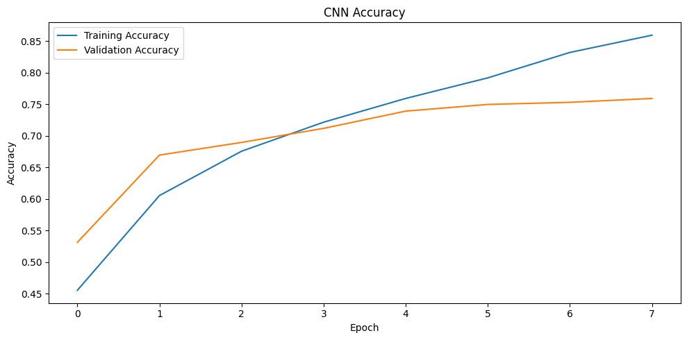
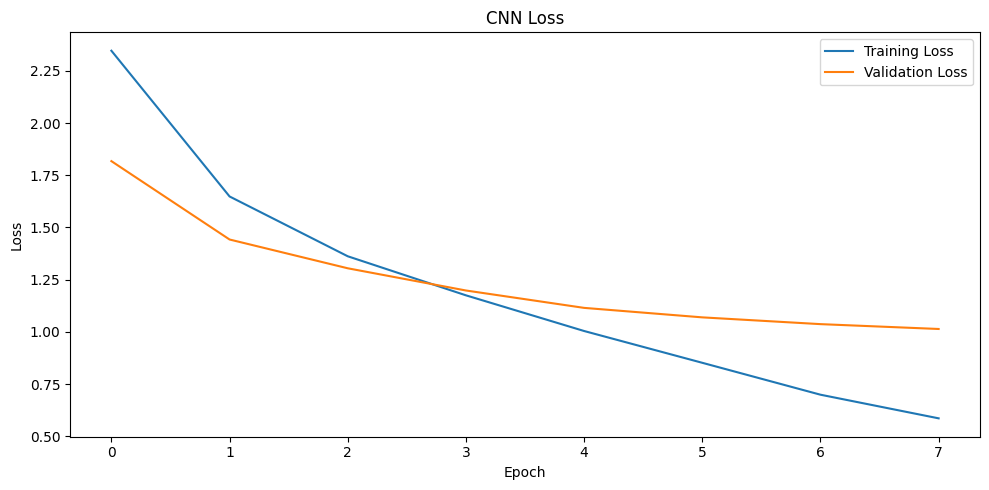

# Deep Learning News Classification

Comparative evaluation of GRU, LSTM, Bidirectional LSTM, 1D CNN, and CNN-LSTM
architectures for multiclass news-topic classification using the Reuters
dataset.

## Overview

This project investigates how different deep learning architectures perform
on the same NLP classification task.

The objective is to compare recurrent, convolutional, and hybrid architectures
under a consistent training and evaluation setup rather than relying on a
single model.

## Problem

Given a newswire represented as a sequence of tokens, predict its topic among
46 possible categories.

### Pipeline

Text Sequence
→ Padding
→ Embedding
→ Neural Network
→ 46-Class Softmax Prediction

## Dataset

The project uses the Reuters newswire classification dataset provided through
TensorFlow/Keras.

- Training samples: 8,982
- Test samples: 2,246
- Classes: 46
- Vocabulary size: 12,000
- Maximum sequence length: 150

The dataset is loaded directly through Keras and is not included in this
repository.

## Architectures

Five architectures were implemented and evaluated:

| Model | Architecture |
|---|---|
| GRU | Embedding → GRU → Softmax |
| LSTM | Embedding → LSTM → Softmax |
| BiLSTM | Embedding → Bidirectional LSTM → Softmax |
| CNN | Embedding → 1D CNN → Global Max Pooling → Softmax |
| CNN-LSTM | Embedding → 1D CNN → Max Pooling → LSTM → Softmax |

## Results

| Model | Test Accuracy |
|---|---:|
| GRU | 61.58% |
| LSTM | 48.84% |
| BiLSTM | 52.72% |
| **CNN** | **75.51%** |
| CNN-LSTM | 54.41% |

### Best Result

The CNN achieved the highest test accuracy in this experiment:

**75.51%**

For the CNN model:

- Accuracy: 75.51%
- Weighted F1-score: 0.7293
- Macro F1-score: 0.3427

The difference between macro and weighted F1 reflects the class imbalance
present in the dataset.

## Model Comparison


## CNN Training

### Accuracy



### Loss



## Analysis

The CNN achieved substantially higher test accuracy than the recurrent and
CNN-LSTM models in this experimental setup.

This result demonstrates that a more complex architecture does not
necessarily provide better performance for every text-classification task.

The experiment also showed a difference between macro and weighted F1,
indicating that performance is not uniform across all 46 classes.

The results should be interpreted as an experimental comparison on the
Reuters benchmark rather than a state-of-the-art result.

## What I Learned

- Sequence preprocessing and padding for NLP
- Word embeddings
- GRU and LSTM sequence modeling
- Bidirectional recurrent networks
- 1D convolution for text feature extraction
- Hybrid CNN-LSTM architectures
- Multiclass neural-network classification
- Validation and test-set evaluation
- Precision, recall and F1-score
- Model comparison and selection
- Effects of class imbalance
- Training versus validation behavior

## Reproducibility

The experiments use a fixed random seed of `42`.

Models use:

- Adam optimizer
- Sparse categorical cross-entropy
- Batch size: 64
- Early stopping based on validation loss
- Maximum of 8 training epochs

Exact results may vary slightly depending on the TensorFlow version and
execution environment.

## Tech Stack

- Python
- TensorFlow
- Keras
- NumPy
- Scikit-learn
- Matplotlib

## Running the Project

### 1. Clone the repository

```bash
git clone https://github.com/<your-username>/deep-learning-news-classification.git
cd deep-learning-news-classification
